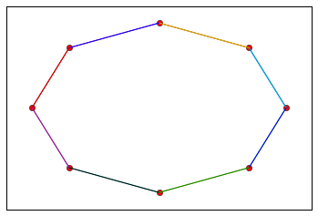
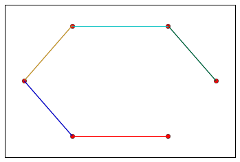
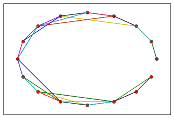
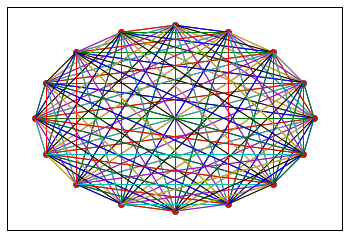
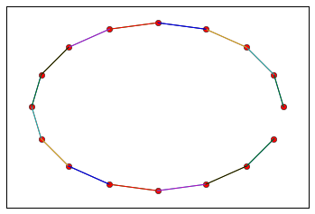

# README

DATK is a Distributed Algorithms Toolkit for Python

## Usage

### Networks

#### Ring Network

    >>> x = Bidirectional_Ring(8)
    >>> x.draw()

    >>> x.state()

    [('P4', {'n': 8}),
     ('P1', {'n': 8}),
     ('P2', {'n': 8}),
     ('P5', {'n': 8}),
     ('P0', {'n': 8}),
     ('P7', {'n': 8}),
     ('P6', {'n': 8}),
     ('P3', {'n': 8})]

#### Line Network

    >>> Bidirectional_Line(6).draw()

#### Random Line Network

    >>> Random_Line_Network(16).draw()

    >>> Random_Line_Network(16, sparsity=0).draw()

    >>> Random_Line_Network(16, sparsity=0.5).draw()

    >>> Random_Line_Network(16, sparsity=float('inf')).draw()

### Algorithms

#### A Basic Algorithm: LCR

    >>> x = Unidirectional_Ring(5)

##### Initial Network State

    >>> x.state()

    [('P2', {'n': 5}),
     ('P4', {'n': 5}),
     ('P1', {'n': 5}),
     ('P0', {'n': 5}),
     ('P3', {'n': 5})]

<!-- -->

    >>> lcr = LCR(x)

    --------------
    Running LCR on
    [P2 -> {P4}, P4 -> {P1}, P1 -> {P0}, P0 -> {P3}, P3 -> {P2}]
    Round 1
    P2.status is non-leader
    P1.status is non-leader
    P0.status is non-leader
    Round 2
    P0.status is non-leader
    Round 3
    P3.status is non-leader
    Round 4
    P2.status is non-leader
    Round 5
    P4.status is leader
    Algorithm Terminated
    Message Complexity: 11
    ----------------------

##### Time Complexity

    >>> print lcr.r, "rounds"

    5 rounds

##### Message Complexity

    >>> print lcr.message_count, "messages"

    11 messages

##### Final Network State

    >>> x.state()

    [('P2', {'n': 5, 'status': 'non-leader'}),
     ('P4', {'n': 5, 'status': 'leader'}),
     ('P1', {'n': 5, 'status': 'non-leader'}),
     ('P0', {'n': 5, 'status': 'non-leader'}),
     ('P3', {'n': 5, 'status': 'non-leader'})]

## Testing

Run tests by executing the following command in the repo directory

    $ python -m datk.tests.tests

    $ python -m datk.tests.networks_tests

## Documentation

Visit [amin10.github.com/datk](http://amin10.github.io/datk/) for documentation

## Made with love by:

Amin Manna ([amin10][amin_gh], [manna@mit.edu][amin_email])

Mayuri Sridhar ([mayuri95][mayuri_gh], [mayuri@mit.edu][mayuri_email])

[amin_email]:mailto:manna@mit.edu
[amin_gh]:http://github.com/amin10
[mayuri_email]:mailto:mayuri@mit.edu
[mayuri_gh]:http://github.com/mayuri95