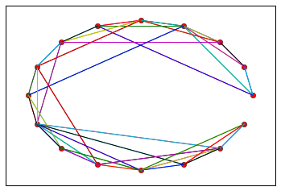
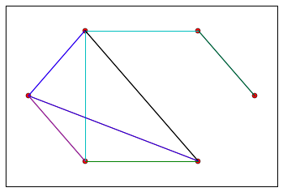
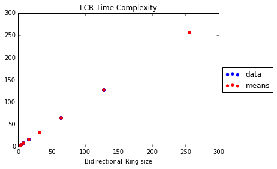
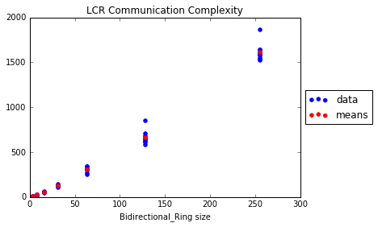
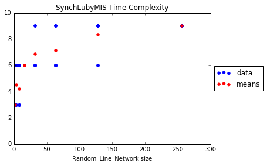
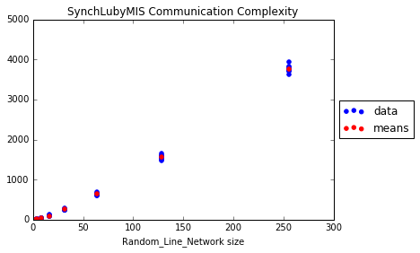

# README

DATK is a Distributed Algorithms Toolkit for Python


## Documentation

Visit [amin10.github.com/datk](http://amin10.github.io/datk/) for documentation


## Testing

Run tests by executing the following command in the repo directory

    $ python -m datk.tests.tests

    $ python -m datk.tests.networks_tests


## Usage

### Networks

#### Ring Network


```python
>>> x = Bidirectional_Ring(8)
>>> x.draw()
```


```python
>>> x.state()
```

<samp>
[('P4', {'n': 8}),  
 ('P1', {'n': 8}),  
 ('P2', {'n': 8}),  
 ('P5', {'n': 8}),  
 ('P0', {'n': 8}),  
 ('P7', {'n': 8}),  
 ('P6', {'n': 8}),  
 ('P3', {'n': 8})]
</samp>


#### Line Network

```python
>>> Bidirectional_Line(6).draw()
```


#### Random Line Network

```python
>>> Random_Line_Network(16).draw()
```


```python
>>> Random_Line_Network(16, sparsity=0).draw()
```


```python
>>> Random_Line_Network(16, sparsity=0.5).draw()
```



```python
>>> Random_Line_Network(16, sparsity=float('inf')).draw()
```


### Algorithms

#### A Basic Algorithm: LCR

```python
>>> x = Unidirectional_Ring(5)
```

##### Initial Network State

```python
>>> x.state()
```

<samp>
[('P2', {'n': 5}),  
 ('P4', {'n': 5}),  
 ('P1', {'n': 5}),  
 ('P0', {'n': 5}),  
 ('P3', {'n': 5})]
</samp>


```python
>>> lcr = LCR(x)
```

<samp>
\--------------  
Running LCR on  
[P2 -> {P4}, P4 -> {P1}, P1 -> {P0}, P0 -> {P3}, P3 -> {P2}]  
Round 1  
P2.status is non-leader  
P1.status is non-leader  
P0.status is non-leader  
Round 2  
P0.status is non-leader  
Round 3  
P3.status is non-leader  
Round 4  
P2.status is non-leader  
Round 5  
P4.status is leader  
Algorithm Terminated  
Message Complexity: 11  
\----------------------
</samp>


##### Time Complexity

```python
>>> print lcr.r, "rounds"
```

<samp>
5 rounds
</samp>

##### Message Complexity

```python
>>> print lcr.message_count, "messages"
```

<samp>
11 messages
</samp>

##### Final Network State

```python
>>> x.state()
```


<samp>
[('P2', {'n': 5, 'status': 'non-leader'}),  
 ('P4', {'n': 5, 'status': 'leader'}),  
 ('P1', {'n': 5, 'status': 'non-leader'}),  
 ('P0', {'n': 5, 'status': 'non-leader'}),  
 ('P3', {'n': 5, 'status': 'non-leader'})]
</samp>


#### Chaining Algorithms

```python
>>> x = Random_Line_Network(6)
```

<!-- -->

```python
# Elect a Leader
>>> FloodMax(x, params={'verbosity': Algorithm.QUIET})
```

<samp>
FloodMax Terminated  
Message Complexity: 80  
Time Complexity: 6  
\------------------
</samp>


```python
# Construct a BFS tree rooted at the Leader 
>>> SynchBFS(x)
```

<samp>
\-------------------  
Running SynchBFS on  
[P3 -> {P4}, P4 -> {P3, P1}, P1 -> {P4, P0, P2, P5}, P0 -> {P1, P2, P5}, P2 -> {P1, P0, P5},   P5 -> {P1, P0, P2}]  
Round 1  
P5.parent is None  
P1.parent is P5  
P0.parent is P5  
P2.parent is P5  
Round 2  
P4.parent is P1  
Round 3  
P3.parent is P4  
Round 4  
SynchBFS Terminated  
Message Complexity: 16  
Time Complexity: 4  
\------------------
</samp>


```python
>>> SynchConvergeHeight(x, params={'draw':True})
```

<samp>
\--------------------------  
Running _ConvergeHeight on  
  
[P3 -> {P4}, P4 -> {P3, P1}, P1 -> {P4, P0, P2, P5}, P0 -> {P1, P2, P5}, P2 -> {P1, P0, P5},   P5 -> {P1, P0, P2}]  
Round 1  
Round 2  
Round 3  
Round 4  
P5.height is 3  
_ConvergeHeight Terminated  
Message Complexity: 8  
Time Complexity: 4  
\------------------
</samp>


```python
>>> x.state()
```

<samp>
[('P3', {'n': 6, 'parent': P4 -> {P3, P1}, 'status': 'non-leader'}),  
 ('P4', {'n': 6, 'parent': P1 -> {P4, P0, P2, P5}, 'status': 'non-leader'}),  
 ('P1', {'n': 6, 'parent': P5 -> {P1, P0, P2}, 'status': 'non-leader'}),  
 ('P0', {'n': 6, 'parent': P5 -> {P1, P0, P2}, 'status': 'non-leader'}),  
 ('P2', {'n': 6, 'parent': P5 -> {P1, P0, P2}, 'status': 'non-leader'}),  
 ('P5', {'height': 3, 'n': 6, 'parent': None, 'status': 'leader'})]
</samp>


#### Equivalently, chain them like this:

```python
>>> x = Random_Line_Network(6)
>>> A = Chain(FloodMax(), Chain(SynchBFS(), SynchConvergeHeight()), params={'verbosity':Algorithm.QUIET})
>>> A(x)
```


<samp>
FloodMax Terminated  
Message Complexity: 50  
Time Complexity: 6  
\------------------  
SynchBFS Terminated  
Message Complexity: 10  
Time Complexity: 5  
\------------------  
_ConvergeHeight Terminated  
Message Complexity: 11  
Time Complexity: 5  
\------------------
</samp>


```python
>>> x.state()
```

<samp>
[('P1', {'n': 6, 'parent': P5 -> {P1, P3}, 'status': 'non-leader'}),  
 ('P5', {'height': 4, 'n': 6, 'parent': None, 'status': 'leader'}),  
 ('P3', {'n': 6, 'parent': P5 -> {P1, P3}, 'status': 'non-leader'}),  
 ('P4', {'n': 6, 'parent': P3 -> {P5, P4}, 'status': 'non-leader'}),  
 ('P0', {'n': 6, 'parent': P4 -> {P3, P0}, 'status': 'non-leader'}),  
 ('P2', {'n': 6, 'parent': P0 -> {P4, P2}, 'status': 'non-leader'})]
</samp>


### Benchmarking Algorithms

```python
>>> benchmark(LCR, Bidirectional_Ring, testLeaderElection)
```

<samp>
Sampling n = 2, 4, 8, 16, 32, 64, 128, 256...  DONE  
  

</samp>


```python
>>> benchmark(SynchLubyMIS, Random_Line_Network, testLubyMIS)
```

<samp>
Sampling n = 2, 4, 8, 16, 32, 64, 128, 256...  DONE  
  

</samp>


## Made with love by:

Amin Manna ([amin10][amin_gh], [manna@mit.edu][amin_email])

Mayuri Sridhar ([mayuri95][mayuri_gh], [mayuri@mit.edu][mayuri_email])

[amin_email]:mailto:manna@mit.edu
[amin_gh]:http://github.com/amin10
[mayuri_email]:mailto:mayuri@mit.edu
[mayuri_gh]:http://github.com/mayuri95